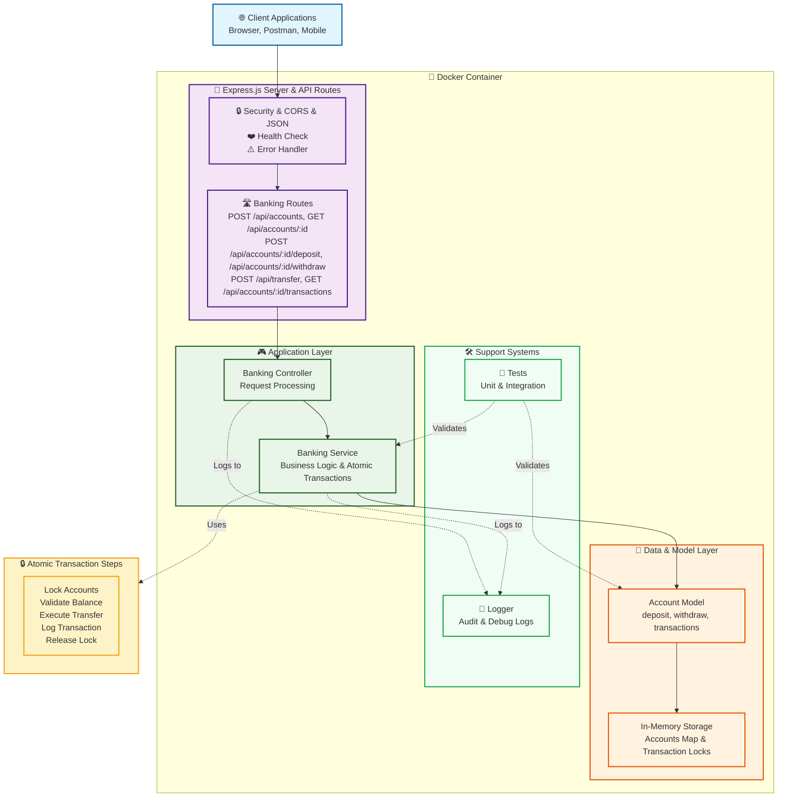

# Simple Banking System

A RESTful API banking system built with Node.js and Express.js featuring atomic transactions, in-memory data storage, and comprehensive testing.

## Features

- ✅ RESTful API implementation
- ✅ Account balance cannot be negative
- ✅ Create accounts with name and initial balance
- ✅ Deposit and withdraw money
- ✅ Transfer money between accounts
- ✅ Transaction logging for all operations
- ✅ Atomic transactions (thread-safe transfers)
- ✅ Unit and integration tests
- ✅ Docker containerization
- ✅ In-memory data storage

## System Architecture



### Architecture Overview

The system follows a **layered architecture** pattern with clear separation of concerns:

- **Client Layer**: External applications (browsers, API clients, mobile apps)
- **API Layer**: Express.js server with security middleware and routing
- **Application Layer**: Controllers handle HTTP requests, Services contain business logic
- **Data Layer**: Account models and in-memory storage with transaction locks
- **Support Systems**: Logging for audit trails and comprehensive test coverage

**Key Features:**
- 🔒 **Atomic Transactions**: Thread-safe transfers with locking mechanisms
- 📝 **Audit Logging**: Complete transaction history and system logs
- 🧪 **Test Coverage**: Unit and integration tests validate all components
- 🐳 **Containerized**: Fully containerized with Docker for consistent deployment

## API Endpoints

### Accounts
- `POST /api/accounts` - Create a new account
- `GET /api/accounts/:accountId` - Get account by ID

### Transactions
- `POST /api/accounts/:accountId/deposit` - Deposit money
- `POST /api/accounts/:accountId/withdraw` - Withdraw money
- `POST /api/transfer` - Transfer money between accounts

### Transaction History
- `GET /api/accounts/:accountId/transactions` - Get transaction history

### Health Check
- `GET /health` - API health status

## Installation & Setup

### Prerequisites
- Docker and Docker Compose installed
- **Package Manager**: This project is optimized for **npm**. While yarn and pnpm are technically compatible, we strongly recommend using npm to ensure consistent dependency versions.

### ⚠️ Important: Package Manager Compatibility

This project uses **strict version control** to ensure stability across different environments:

- **Recommended**: `npm install` (fully supported with package-lock.json)
- **Not Recommended**: `yarn install` or `pnpm install` (may cause version conflicts)

If you must use yarn or pnpm, please be aware of potential compatibility issues with:
- Express v5.x features
- Jest v30.x configurations  
- Helmet v8.x security policies

### Development with Docker

1. **Initialize project** (first time only):
   ```bash
   # Create initial project structure
   docker-compose --profile init up init
   ```

2. **Start development environment**:
   ```bash
   # Build and run in background
   docker-compose up --build -d
   
   # View logs
   docker-compose logs -f banking-api
   ```

3. **Stop the services**:
   ```bash
   docker-compose down
   ```

### Production Deployment

```bash
# Run production version
docker-compose --profile production up banking-api-prod -d
```

### Manual Docker Build (Alternative)

```bash
# Build image manually
docker build -t banking-api .

# Run container
docker run -p 3000:3000 banking-api
```

## Development Workflow

### Daily Development
```bash
# Start services in background
docker-compose up -d

# Check service status
docker-compose ps

# View logs
docker-compose logs banking-api

# Run tests
docker-compose exec banking-api npm test

# Check API health
curl http://localhost:3000/health
```

### Development Tools
```bash
# Enter container for debugging
docker-compose exec banking-api sh

# Restart specific service
docker-compose restart banking-api

# Rebuild and restart
docker-compose up --build banking-api -d
```

## Development Options

Choose your preferred development environment:

### Option 1: Standard Docker Development (Recommended)

This is the main development approach, supporting all editors and IDEs:

```bash
# Start development environment
docker-compose up --build -d

# Run tests
docker-compose exec banking-api npm test

# View logs
./scripts/view-logs.sh live

# Enter container for debugging
docker-compose exec banking-api sh
```

**Advantages:**
- ✅ Works with any editor (VS Code, IntelliJ, Vim, etc.)
- ✅ Simple and straightforward
- ✅ No additional VS Code dependencies
- ✅ Fast setup

### Option 2: Dev Container (VS Code/Cursor)

For VS Code or Cursor users who want deeper IDE integration:

1. **Prerequisites:**
   - VS Code with Dev Containers extension, OR
   - Cursor (has built-in Dev Container support)
   - Docker and Docker Compose

2. **Setup:**
   ```bash
   # For VS Code
   code .
   # Press F1 → "Dev Containers: Reopen in Container"
   
   # For Cursor  
   cursor .
   # Press Cmd/Ctrl+Shift+P → "Dev Containers: Reopen in Container"
   ```

**Advantages:**
- ✅ Deep VS Code integration
- ✅ IntelliSense and debugging in container
- ✅ Extensions run inside container
- ✅ Consistent development environment

**Note:** Both approaches use the same Docker configuration, so you can switch between them anytime.

## API Usage Examples
```bash
curl -X POST http://localhost:3000/api/accounts \
  -H "Content-Type: application/json" \
  -d '{"name": "John Doe", "initialBalance": 1000}'
```

### Deposit Money
```bash
curl -X POST http://localhost:3000/api/accounts/{accountId}/deposit \
  -H "Content-Type: application/json" \
  -d '{"amount": 500}'
```

### Transfer Money
```bash
curl -X POST http://localhost:3000/api/transfer \
  -H "Content-Type: application/json" \
  -d '{
    "fromAccountId": "account-1-id",
    "toAccountId": "account-2-id", 
    "amount": 250
  }'
```

## Testing

Run tests inside Docker container:

```bash
# Run all tests
docker-compose exec banking-api npm test

# Run tests with coverage
docker-compose exec banking-api npm test -- --coverage

# Run specific test files
docker-compose exec banking-api npm test tests/unit/
docker-compose exec banking-api npm test tests/integration/

# Run tests in watch mode (for development)
docker-compose exec banking-api npm test -- --watch
```

### Test Structure
```
tests/
├── unit/                        # Unit tests
│   ├── Account.test.js
│   └── BankingService.test.js
└── integration/                 # Integration tests
    └── banking.integration.test.js
```

## Architecture

- **Models**: Account entity with business logic
- **Services**: Banking service with core operations
- **Controllers**: HTTP request handlers
- **Routes**: API endpoint definitions
- **Atomic Transactions**: Locking mechanism for safe transfers
- **Error Handling**: Comprehensive error responses
- **Validation**: Input validation for all operations

## Security Features

- Input validation and sanitization
- Atomic transaction locks
- Negative balance prevention
- Non-root Docker user
- Health checks
- Container isolation

## Docker Configuration

### Services
- **banking-api**: Development service with live reload
- **banking-api-prod**: Production-optimized service
- **init**: Project initialization service

### Environment Variables
- `NODE_ENV`: development/production
- `PORT`: Service port (default: 3000)

### Volumes
- `./src:/app/src`: Live code reloading in development
- `./tests:/app/tests`: Test files mounting
- `/app/node_modules`: Dependency isolation

## Logging

The banking system includes comprehensive logging for debugging, monitoring, and audit purposes.

### Log Files

```bash
# View logs from host machine
ls ./logs/

# Common log files:
./logs/app.log          # All application logs
./logs/error.log        # Error logs only
./logs/transactions.log # Banking transaction logs
```

### Log Viewing Commands

```bash
# View recent application logs
./scripts/view-logs.sh app 100

# View error logs
./scripts/view-logs.sh error

# View transaction logs
./scripts/view-logs.sh transaction 50

# Live log monitoring
./scripts/view-logs.sh live

# Log statistics
./scripts/view-logs.sh stats

# From within Docker container
docker-compose exec banking-api cat /app/logs/app.log
docker-compose exec banking-api tail -f /app/logs/app.log
```

### Log Format

All logs are in JSON format for easy parsing:

```json
{
  "timestamp": "2025-06-22T10:30:00.000Z",
  "level": "INFO",
  "message": "Account created",
  "action": "CREATE_ACCOUNT",
  "accountId": "abc-123",
  "accountName": "John Doe",
  "initialBalance": 1000
}
```

### Log Retention

- Logs are persistent across container restarts
- Logs are excluded from git (privacy protection)
- Consider log rotation for production use